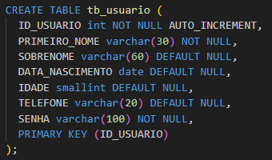
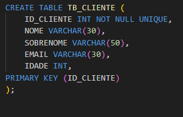
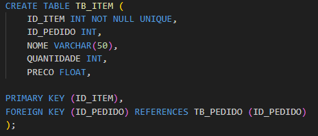
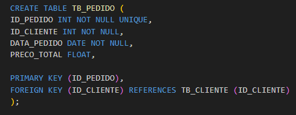

Na primeira etapa da atividade, utilizei a tabela de usuário. Criei os métodos inserirUsuario e getUsuario, tanto para meu banco local, para testes, quanto para o banco de dados rds.

Para testar os métodos, utilizei o Postman e enviei requisições HTTP relativas a cada método os controladores. Seguem abaixo alguns prints com exemplos dos métodos funcionando.

Na segunda etapa, as tabelas TB_CLIENTE e TB_PEDIDO representam as entidades cliente e pedido, já a tabela TB_ITEM representa a relação entre o cliente e seu pedido. Cada item contém os atributos nome, quantidade e preço, além do ID do pedido ao qual o item pertence. 

  

A aplicação foi desenvolvida em Java, utilizei o framework Spring Boot e o JDBC.

